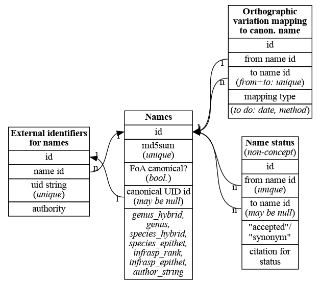

# Assembling names into a database

For each new resource:

 1. Add all new names to `names` table (a name is new if its md5sum is
    not matched in `names.md5sum`).  For the original canonical list, the 
    status of `names.canonical` is set to `T`.
 2. Insert the uid strings into `uids` for all new names added. For
    the original canonical list, link the canonical name to the canonical
    uid.
 
Here’s the ER diagram of the database:

Please read the individual (commented) SQL files for details.

## Queries and mapping

  Src1   o   Can  o  Src2    Result
  =====  == ===== == =====   ======

1   A*   =    A   =    A*    S1==S2  

2   A*   =    A   <-   B*    S1==S2

3   A*   ->   B   <-   C*    S1==S2

4   A*   =    A  
              B   =    B*    S1!=S2

5   A*   =    A  
              C   <-   B*    S1!=S2

4   A*   =    A
              B      B*    S1!=S2

    A    ->   B   =    B   
    |s                 |s
    v                  v
    C    =    C   =    C

